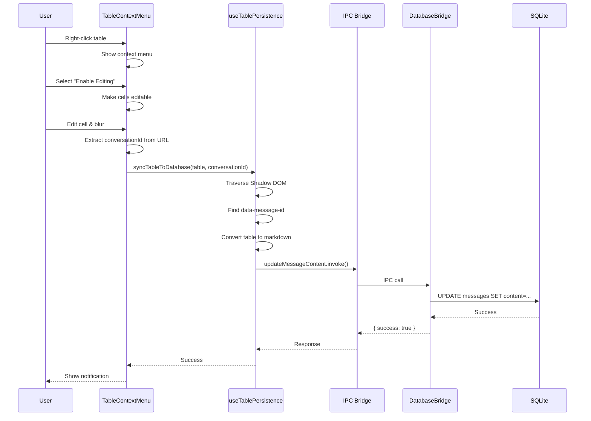

# Architecture Complète - Menu Contextuel et Persistance des Tables

## Vue d'Ensemble

Le système de menu contextuel pour les tables dans AIONUI permet aux utilisateurs de modifier des tableaux markdown directement dans l'interface de chat, avec persistance automatique des modifications dans la base de données SQLite.

## Architecture Globale

```
┌─────────────────────────────────────────────────────────────────┐
│                         USER INTERFACE                          │
│  (Renderer Process - React Components)                          │
└─────────────────────────────────────────────────────────────────┘
                              │
                              ▼
┌─────────────────────────────────────────────────────────────────┐
│                    SHADOW DOM BOUNDARY                          │
│  (Markdown rendering with isolated styles)                      │
└─────────────────────────────────────────────────────────────────┘
                              │
                              ▼
┌─────────────────────────────────────────────────────────────────┐
│                      IPC BRIDGE                                 │
│  (Electron IPC - Cross-process communication)                   │
└─────────────────────────────────────────────────────────────────┘
                              │
                              ▼
┌─────────────────────────────────────────────────────────────────┐
│                    MAIN PROCESS                                 │
│  (Database operations, file system access)                      │
└─────────────────────────────────────────────────────────────────┘
                              │
                              ▼
┌─────────────────────────────────────────────────────────────────┐
│                    SQLITE DATABASE                              │
│  (Persistent storage for conversations and messages)            │
└─────────────────────────────────────────────────────────────────┘
```

## Composants Principaux

### 1. Structure DOM et Shadow DOM

#### Hiérarchie DOM Complète

```html
<div class="message-item" data-message-id="msg-123" data-msg-id="456">
  <!-- MessageItem wrapper (MessageList.tsx) -->
  
  <MessageText>
    <div class="flex gap-8px group w-full">
      <!-- Avatar -->
      <Avatar />
      
      <!-- Content -->
      <div class="flex flex-col flex-1">
        <div class="text-12px">User</div>
        
        <!-- Markdown Content -->
        <MarkdownView>
          <!-- Shadow DOM Boundary -->
          #shadow-root (open)
            <div class="markdown-shadow-body">
              <!-- Rendered Markdown -->
              <table>
                <thead>
                  <tr>
                    <th>Column 1</th>
                    <th>Column 2</th>
                  </tr>
                </thead>
                <tbody>
                  <tr>
                    <td>Data 1</td>
                    <td>Data 2</td>
                  </tr>
                </tbody>
              </table>
            </div>
        </MarkdownView>
      </div>
    </div>
  </MessageText>
</div>
```

#### Importance du Shadow DOM

Le Shadow DOM est utilisé pour isoler les styles du markdown et éviter les conflits CSS. Cependant, il crée une **barrière** qui empêche les méthodes DOM standard comme `closest()` de traverser vers les parents en dehors du Shadow DOM.

**Conséquence critique** : Pour trouver `data-message-id`, nous devons traverser manuellement la frontière du Shadow DOM.

### 2. Composants React

#### MessageList.tsx

**Rôle** : Conteneur principal des messages avec l'attribut `data-message-id`

**Code clé** :
```tsx
const MessageItem: React.FC<{ message: TMessage }> = React.memo(
  HOC((props) => {
    const { message } = props as { message: TMessage };
    return (
      <div
        className="message-item"
        data-message-id={message.id}      // ← CRITIQUE pour la persistance
        data-msg-id={message.msg_id}
      >
        {props.children}
      </div>
    );
  })
);
```

**Pourquoi ici ?** : Le wrapper `.message-item` est le parent commun de tous les types de messages et est accessible depuis l'extérieur du Shadow DOM.

#### TableContextMenu.tsx

**Rôle** : Gère le menu contextuel (clic droit) sur les tables

**Fonctionnalités** :
- Détection des tables dans le Shadow DOM
- Affichage du menu contextuel
- Opérations sur les tables (édition, insertion, suppression)
- Déclenchement de la synchronisation avec la base de données

**Flux d'événements** :
```
User right-clicks on table
    ↓
contextmenu event captured (capture phase)
    ↓
Check if target is inside a table
    ↓
Traverse Shadow DOM to find table element
    ↓
Show context menu at cursor position
    ↓
User selects operation (e.g., "Enable Editing")
    ↓
Execute operation on table
    ↓
Call syncTable() to persist changes
```

**Code clé - Détection des tables** :
```tsx
useEffect(() => {
  const handleContextMenu = (e: MouseEvent) => {
    // Use capture phase to intercept before Electron menu
    let target = e.target as HTMLElement;
    
    // Traverse Shadow DOM to find table
    while (target) {
      if (target.shadowRoot) {
        const shadowTable = target.shadowRoot.querySelector('table');
        if (shadowTable) {
          // Found table in Shadow DOM
          setTargetTable(shadowTable as HTMLTableElement);
          showMenu(e.clientX, e.clientY);
          e.preventDefault();
          return;
        }
      }
      target = target.parentElement;
    }
  };

  document.addEventListener('contextmenu', handleContextMenu, true); // capture phase
  return () => document.removeEventListener('contextmenu', handleContextMenu, true);
}, []);
```

#### useTablePersistence.ts

**Rôle** : Hook React pour la persistance des modifications de table

**Fonctionnalités** :
- Traversée du Shadow DOM pour trouver `data-message-id`
- Conversion de la table HTML en markdown
- Appel IPC pour mettre à jour la base de données

**Algorithme de traversée Shadow DOM** :

```typescript
function findMessageContainer(table: HTMLTableElement): Element | null {
  let currentElement: Element | null = table;

  while (currentElement) {
    // Check if current element has data-message-id
    if (currentElement.hasAttribute('data-message-id')) {
      return currentElement;
    }

    // Try normal parent traversal
    const parent = currentElement.parentElement;

    if (!parent && currentElement.parentNode) {
      // We might be at a shadow root boundary
      const parentNode = currentElement.parentNode;
      
      if (parentNode.nodeType === Node.DOCUMENT_FRAGMENT_NODE) {
        // This is a shadow root - cross the boundary
        const shadowRoot = parentNode as ShadowRoot;
        if (shadowRoot.host) {
          currentElement = shadowRoot.host; // ← Cross Shadow DOM boundary
          continue;
        }
      }
    }

    if (!parent) break;
    currentElement = parent;
  }

  return null;
}
```

**Conversion Table → Markdown** :

```typescript
function tableToMarkdown(table: HTMLTableElement): string {
  const rows: string[] = [];

  // Process header
  const thead = table.querySelector('thead');
  if (thead) {
    const headerRow = thead.querySelector('tr');
    if (headerRow) {
      const headers = Array.from(headerRow.querySelectorAll('th, td'))
        .map((cell) => cell.textContent?.trim() || '')
        .join(' | ');
      rows.push(`| ${headers} |`);

      // Add separator
      const separator = Array.from(headerRow.querySelectorAll('th, td'))
        .map(() => '---')
        .join(' | ');
      rows.push(`| ${separator} |`);
    }
  }

  // Process body rows
  const tbody = table.querySelector('tbody');
  const bodyRows = tbody ? tbody.querySelectorAll('tr') : table.querySelectorAll('tr');
  
  bodyRows.forEach((row) => {
    const cells = Array.from(row.querySelectorAll('td, th'))
      .map((cell) => cell.textContent?.trim() || '')
      .join(' | ');
    rows.push(`| ${cells} |`);
  });

  return '\n' + rows.join('\n') + '\n';
}
```

### 3. IPC Bridge (Communication Inter-Processus)

#### ipcBridge.ts

**Définition de la route IPC** :

```typescript
export const database = {
  getConversationMessages: bridge.buildProvider<TMessage[], { 
    conversation_id: string; 
    page?: number; 
    pageSize?: number 
  }>('database.get-conversation-messages'),
  
  getUserConversations: bridge.buildProvider<TChatConversation[], { 
    page?: number; 
    pageSize?: number 
  }>('database.get-user-conversations'),
  
  updateMessageContent: bridge.buildProvider<
    { success: boolean; error?: string }, 
    { messageId: string; conversationId: string; content: string }
  >('database.update-message-content'), // ← Route pour la persistance
};
```

**Utilisation dans le Renderer** :

```typescript
await ipcBridge.database.updateMessageContent.invoke({
  messageId: 'msg-123',
  conversationId: 'conv-456',
  content: '| Col1 | Col2 |\n|------|------|\n| A | B |'
});
```

#### databaseBridge.ts

**Implémentation côté Main Process** :

```typescript
export function initDatabaseBridge(): void {
  ipcBridge.database.updateMessageContent.provider(({ messageId, conversationId, content }) => {
    try {
      const db = getDatabase();
      
      // Get existing message
      const messages = db.getConversationMessages(conversationId, 0, 10000);
      const existingMessage = messages.data?.find((msg) => msg.id === messageId);
      
      if (!existingMessage) {
        return Promise.resolve({ success: false, error: 'Message not found' });
      }

      // Update message content
      const updatedMessage = {
        ...existingMessage,
        content: {
          ...existingMessage.content,
          content, // ← New markdown content
        },
      };

      const result = db.updateMessage(messageId, updatedMessage);
      
      if (result.success) {
        console.log('[DatabaseBridge] Message updated:', messageId);
        return Promise.resolve({ success: true });
      } else {
        return Promise.resolve({ success: false, error: result.error });
      }
    } catch (error) {
      console.error('[DatabaseBridge] Error:', error);
      return Promise.resolve({ success: false, error: String(error) });
    }
  });
}
```

### 4. Base de Données SQLite

#### Structure de la Table `messages`

```sql
CREATE TABLE messages (
  id TEXT PRIMARY KEY,
  conversation_id TEXT NOT NULL,
  msg_id TEXT,
  type TEXT NOT NULL,
  position TEXT,
  content TEXT, -- JSON stringifié contenant le contenu markdown
  created_at INTEGER,
  updated_at INTEGER,
  FOREIGN KEY (conversation_id) REFERENCES conversations(id)
);
```

#### Format du Contenu

Le champ `content` est un JSON stringifié :

```json
{
  "content": "| Col1 | Col2 |\n|------|------|\n| Data1 | Data2 |",
  "type": "text"
}
```

## Flux de Données Complet

### Scénario : Modification d'une Cellule de Table

```
1. USER ACTION
   └─ User right-clicks on table
   └─ Selects "Enable Editing"
   └─ Modifies cell content
   └─ Clicks outside cell (blur event)

2. RENDERER PROCESS (React)
   └─ TableContextMenu detects blur event
   └─ Calls syncTable()
   └─ Extracts conversationId from URL
   └─ Calls useTablePersistence.syncTableToDatabase()

3. SHADOW DOM TRAVERSAL
   └─ Start from <table> element
   └─ Traverse parents: table → div.markdown-shadow-body
   └─ Hit Shadow DOM boundary (DOCUMENT_FRAGMENT_NODE)
   └─ Cross to shadowRoot.host
   └─ Continue: host → MarkdownView → MessageText → div.message-item
   └─ Find data-message-id attribute ✓

4. TABLE CONVERSION
   └─ Extract table HTML
   └─ Convert to markdown format
   └─ Result: "| Col1 | Col2 |\n|------|------|\n| Data1 | Data2 |"

5. IPC CALL
   └─ ipcBridge.database.updateMessageContent.invoke({
        messageId: "msg-123",
        conversationId: "conv-456",
        content: "..."
      })

6. MAIN PROCESS (Electron)
   └─ databaseBridge receives IPC call
   └─ Gets database instance
   └─ Finds existing message by messageId
   └─ Updates message.content.content with new markdown
   └─ Calls db.updateMessage()

7. SQLITE DATABASE
   └─ UPDATE messages 
      SET content = '{"content":"...","type":"text"}',
          updated_at = 1234567890
      WHERE id = 'msg-123'

8. RESPONSE
   └─ Main Process returns { success: true }
   └─ Renderer Process logs success
   └─ User sees confirmation

9. PERSISTENCE VERIFICATION
   └─ User refreshes page (F5)
   └─ MessageList loads messages from database
   └─ Modified table content is rendered
   └─ Modifications are persistent ✓
```

## Points Critiques de l'Architecture

### 1. Shadow DOM - La Barrière Invisible

**Problème** : `Element.closest()` ne traverse pas les frontières du Shadow DOM.

**Solution** : Traversée manuelle avec détection de `Node.DOCUMENT_FRAGMENT_NODE`.

**Code Pattern** :
```typescript
if (parentNode.nodeType === Node.DOCUMENT_FRAGMENT_NODE) {
  const shadowRoot = parentNode as ShadowRoot;
  currentElement = shadowRoot.host; // Cross boundary
}
```

### 2. Placement de data-message-id

**Mauvais** : Dans MessageText (à l'intérieur du Shadow DOM)
```tsx
// ❌ Ne fonctionne pas
<MessageText>
  <div data-message-id={message.id}>
    <MarkdownView>
      #shadow-root
        <table> ← Ne peut pas atteindre data-message-id
```

**Bon** : Dans MessageItem (à l'extérieur du Shadow DOM)
```tsx
// ✓ Fonctionne
<div class="message-item" data-message-id={message.id}>
  <MessageText>
    <MarkdownView>
      #shadow-root
        <table> ← Peut traverser vers data-message-id
```

### 3. Event Capture Phase

**Problème** : Electron a son propre menu contextuel qui intercepte l'événement.

**Solution** : Utiliser la phase de capture avec `addEventListener(..., true)`.

```typescript
document.addEventListener('contextmenu', handler, true); // ← capture phase
```

### 4. Extraction du conversationId

**Source** : URL de la page

**Patterns supportés** :
- `/conversation/[id]`
- `/chat/[id]` ou `/c/[id]`
- `?conversation_id=[id]` ou `?id=[id]`

**Code** :
```typescript
const url = window.location.href;
let match = url.match(/\/conversation\/([^/?#]+)/);
if (!match) match = url.match(/\/(?:chat|c)\/([^/?#]+)/);
if (!match) {
  const urlObj = new URL(url);
  const convId = urlObj.searchParams.get('conversation_id') || 
                 urlObj.searchParams.get('id');
  if (convId) match = [url, convId];
}
const conversationId = match ? match[1] : null;
```

## Fichiers Clés

### Renderer Process (src/renderer/)

| Fichier | Rôle | Lignes Clés |
|---------|------|-------------|
| `messages/MessageList.tsx` | Wrapper avec data-message-id | 52-56 |
| `messages/MessagetText.tsx` | Rendu du message texte | 127 |
| `components/TableContextMenu.tsx` | Menu contextuel | 100-135 |
| `hooks/useTablePersistence.ts` | Persistance | 35-90 |

### Main Process (src/process/)

| Fichier | Rôle | Lignes Clés |
|---------|------|-------------|
| `bridge/databaseBridge.ts` | IPC handler | 70-94 |
| `database.ts` | SQLite operations | - |

### Common (src/common/)

| Fichier | Rôle | Lignes Clés |
|---------|------|-------------|
| `ipcBridge.ts` | IPC route definitions | 346-348 |

## Diagramme de Séquence



## Conclusion

Cette architecture permet une persistance transparente des modifications de tables en gérant correctement :
1. Le Shadow DOM et ses frontières
2. La communication IPC entre processus Electron
3. La mise à jour atomique de la base de données SQLite
4. La conversion bidirectionnelle HTML ↔ Markdown

La clé du succès réside dans la traversée manuelle du Shadow DOM et le placement stratégique de `data-message-id` au bon niveau du DOM.
